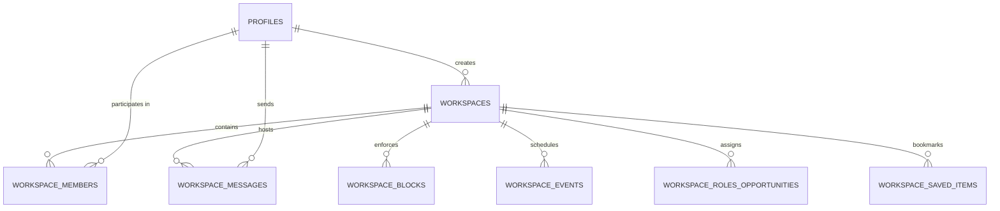

# WORKSPACE SCHEMA DESIGN (PHASE 2)

**Status**: APPROVED DESIGN  
**Target Migration**: `supabase/migrations/20261008000001_booffin_workspace_system.sql`  
**Database**: Supabase PostgreSQL 15+

---

## 1. Unified Relational Entity-Relationship Diagram

---

## 2. Table Specifications

### 2.1 `public.workspaces`
Core workspace container for DM, Community, and Inner Circle tiers.
- `id`: UUID PRIMARY KEY (gen_random_uuid())
- `type`: `public.workspace_type` (`dm`, `community`, `inner_circle`) NOT NULL
- `creator_id`: UUID NOT NULL REFERENCES `public.profiles(id)` ON DELETE CASCADE
- `name`: TEXT (Community name, Inner Circle title, or NULL for DMs)
- `description`: TEXT
- `avatar_url`: TEXT
- `topic_tag`: TEXT (e.g. 'Neuroscience', 'Quantum Physics')
- `creator_research_role`: TEXT (e.g. 'PI', 'PhD Researcher', 'Student Researcher')
- `pricing_tier`: `public.workspace_subscription_tier` (`tier_49`, `tier_119`, `tier_219`, `tier_599`)
- `price_inr`: INTEGER (49, 119, 219, 599)
- `max_members`: INTEGER DEFAULT 25 (Enforced for Inner Circle)
- `e2ee_enabled`: BOOLEAN DEFAULT false
- `dm_participant_a`: UUID REFERENCES `public.profiles(id)` ON DELETE CASCADE
- `dm_participant_b`: UUID REFERENCES `public.profiles(id)` ON DELETE CASCADE
- `canonical_dm_key`: TEXT UNIQUE (Deterministic composite key: `LEAST(a, b) || ':' || GREATEST(a, b)`)
- `created_at`: TIMESTAMPTZ DEFAULT now()
- `updated_at`: TIMESTAMPTZ DEFAULT now()

### 2.2 `public.workspace_members`
Role-based access & status tracker.
- `id`: UUID PRIMARY KEY
- `workspace_id`: UUID NOT NULL REFERENCES `public.workspaces(id)` ON DELETE CASCADE
- `user_id`: UUID NOT NULL REFERENCES `public.profiles(id)` ON DELETE CASCADE
- `role`: `public.workspace_member_role` (`owner`, `admin`, `moderator`, `member`)
- `status`: TEXT DEFAULT 'active' (`active`, `invited`, `removed`, `blocked`)
- `joined_at`: TIMESTAMPTZ DEFAULT now()
- `UNIQUE (workspace_id, user_id)`

### 2.3 `public.workspace_messages`
Message delivery payload (plaintext for DM/Community, ciphertext string for Inner Circle).
- `id`: UUID PRIMARY KEY
- `workspace_id`: UUID NOT NULL REFERENCES `public.workspaces(id)` ON DELETE CASCADE
- `sender_id`: UUID NOT NULL REFERENCES `public.profiles(id)` ON DELETE CASCADE
- `content`: TEXT NOT NULL
- `doi_reference`: TEXT (Attached DOI paper identifier)
- `attachments`: JSONB DEFAULT '[]'::jsonb
- `key_epoch`: INTEGER DEFAULT 1 (For Inner Circle E2EE key rotation)
- `created_at`: TIMESTAMPTZ DEFAULT now()

### 2.4 `public.workspace_blocks`
Community creator block ledger with immutable reason tracking.
- `id`: UUID PRIMARY KEY
- `workspace_id`: UUID NOT NULL REFERENCES `public.workspaces(id)` ON DELETE CASCADE
- `blocked_by`: UUID NOT NULL REFERENCES `public.profiles(id)` ON DELETE CASCADE
- `blocked_user`: UUID NOT NULL REFERENCES `public.profiles(id)` ON DELETE CASCADE
- `reason_type`: TEXT NOT NULL ('Harassment', 'Spam', 'Off-topic behaviour', 'Disruptive behaviour', 'Misleading information', 'Inappropriate content', 'Repeated rule violations', 'Other')
- `reason_text`: TEXT NOT NULL
- `created_at`: TIMESTAMPTZ DEFAULT now()
- `UNIQUE (workspace_id, blocked_user)`

### 2.5 `public.workspace_events`
Inner Circle and Community calendar & symposiums.
- `id`: UUID PRIMARY KEY
- `workspace_id`: UUID NOT NULL REFERENCES `public.workspaces(id)` ON DELETE CASCADE
- `creator_id`: UUID NOT NULL REFERENCES `public.profiles(id)` ON DELETE CASCADE
- `title`: TEXT NOT NULL
- `description`: TEXT
- `event_date`: TIMESTAMPTZ NOT NULL
- `location_or_url`: TEXT
- `attendee_ids`: UUID[] DEFAULT '{}'
- `created_at`: TIMESTAMPTZ DEFAULT now()

### 2.6 `public.workspace_roles_opportunities`
Inner Circle research roles & open lab opportunities.
- `id`: UUID PRIMARY KEY
- `workspace_id`: UUID NOT NULL REFERENCES `public.workspaces(id)` ON DELETE CASCADE
- `assigned_user_id`: UUID REFERENCES `public.profiles(id)` ON DELETE SET NULL
- `title`: TEXT NOT NULL
- `role_type`: TEXT NOT NULL ('designation', 'opportunity')
- `description`: TEXT
- `status`: TEXT DEFAULT 'open' ('open', 'assigned', 'closed')
- `created_at`: TIMESTAMPTZ DEFAULT now()

### 2.7 `public.workspace_saved_items`
Bookmarks for discussions, papers, and opportunities within workspaces.
- `id`: UUID PRIMARY KEY
- `workspace_id`: UUID NOT NULL REFERENCES `public.workspaces(id)` ON DELETE CASCADE
- `user_id`: UUID NOT NULL REFERENCES `public.profiles(id)` ON DELETE CASCADE
- `item_type`: TEXT NOT NULL ('message', 'paper', 'discussion', 'event', 'opportunity')
- `item_id`: TEXT NOT NULL
- `title`: TEXT NOT NULL
- `metadata`: JSONB DEFAULT '{}'::jsonb
- `created_at`: TIMESTAMPTZ DEFAULT now()
