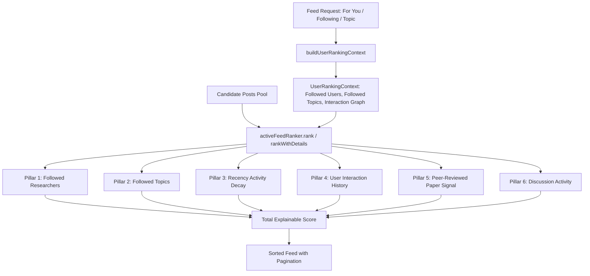

# BooffIn Feed Ranking Architecture

## 1. Scientific Philosophy & Core Principles

BooffIn is an academic and scientific social platform designed to connect researchers and accelerate scientific discovery.

The feed ranking system adheres to the following foundational principles:

1. **Constructive Discourse Over Virality**: Academic inquiries, methodological critiques, and peer insights are prioritized over raw like volume.
2. **Zero Clickbait Optimization**: Standard social network algorithms maximize passive engagement (outrage, likes, quick reactions). BooffIn instead values research relevance, author affinity, and substantive discussions.
3. **Transparent & Explainable**: The initial algorithm is fully deterministic and rule-based. Every ranked post can provide an exact mathematical breakdown of its ranking components.
4. **No Machine Learning (v1)**: Deterministic heuristics provide predictable, bug-free, and auditable feeds before introducing statistical recommendation models.
5. **Modular & Future-Proof**: Ranking logic is abstracted behind the `IFeedRanker` interface, enabling drop-in vector embeddings, collaborative filtering, or hybrid ML models without altering the frontend or state stores.

---

## 2. Architecture & Interface Design



### Pluggable Interface (`src/api/ranking/types.ts`)

```typescript
export interface IFeedRanker {
  name: string;
  rank(posts: Post[], context: UserRankingContext): Post[];
  rankWithDetails(posts: Post[], context: UserRankingContext): RankedPost[];
}
```

To introduce an ML or hybrid model in the future:
```typescript
import { setFeedRanker } from '@/api/ranking/feedRanker';

class VectorSemanticFeedRanker implements IFeedRanker {
  name = 'BooffIn Embedding Ranker (v2)';
  rank(posts: Post[], context: UserRankingContext): Post[] {
    // Vector similarity + collaborative filtering
  }
}

setFeedRanker(new VectorSemanticFeedRanker());
```

---

## 3. The 6-Pillar Ranking Algorithm

The `RuleBasedFeedRanker` evaluates each post against the `UserRankingContext` across six explicit dimensions:

$$\text{Total Score} = S_{\text{author}} + S_{\text{topic}} + S_{\text{recency}} + S_{\text{interaction}} + S_{\text{research}} + S_{\text{discussion}}$$

### Pillar 1: Followed Researchers ($S_{\text{author}}$)
- **Weight**: $+120\text{ pts}$
- If the post author is in the user's `followedUserIds` set, the post receives an immediate high-priority boost.

### Pillar 2: Followed Topics ($S_{\text{topic}}$)
- **Weight**: $+60\text{ pts}$ per matching topic (capped at $+180\text{ pts}$)
- Evaluates the intersection between `post.topics` and the user's `followedTopicNames` (from relational `topic_follows` table).

### Pillar 3: Recent Activity & Time Decay ($S_{\text{recency}}$)
- **Weight**: $0 \text{ to } +100\text{ pts}$
- Fresh research and active discussions receive high prominence:
  - Minutes ago / Just now: $+100\text{ pts}$
  - Hours ago: $\max(20, 95 - 3.5 \times \text{hours})$
  - Days ago: $\max(0, 50 - 7 \times \text{days})$

### Pillar 4: User Interaction History ($S_{\text{interaction}}$)
- **Weights**:
  - Prior interactions with author: $+35\text{ pts}$
  - Prior interactions with paper: $+30\text{ pts}$
  - Prior interactions with topic: $+20\text{ pts}$
  - Seen/Interacted post penalty: $-20\text{ pts}$ (prevents feed stagnation and surfaces novel research)

### Pillar 5: Paper-Topic Relevance & Research Signal ($S_{\text{research}}$)
- **Weights**:
  - Peer-reviewed paper reference attached: $+45\text{ pts}$
  - Open Access availability: $+15\text{ pts}$
  - Registered DOI present: $+10\text{ pts}$
  - General research share breakdown: $+25\text{ pts}$

### Pillar 6: Discussion Activity ($S_{\text{discussion}}$)
- **Weights**:
  - Scientific comments / questions: $\text{commentsCount} \times 5.0$
  - Citations / reposts: $\text{repostsCount} \times 3.0$
  - Passive likes: $\text{likesCount} \times 0.5$ (deliberately low-weighted to avoid clickbait)

---

## 4. Feed Type Specifications

| Feed Tab | Target Audience | Behavior |
| :--- | :--- | :--- |
| **For You** | Discovery & Personalized Science | Runs the full 6-pillar ranking engine against user context. |
| **Following** | Direct Social Graph | Strictly filters posts by followed researchers, ordered by recency and active discussion threads. |
| **Topic Feeds** | Discipline Exploration | Filters candidate posts by topic slug/name, ranked with research signal and discussion activity. |

---

## 5. Pagination & Performance

- Feeds are paginated with `page` and `pageSize` (default: 10 items per page).
- In Supabase mode, candidate queries utilize single-roundtrip joined queries (`posts`, `profiles`, `papers`, `topics`, `likes`, `reposts`, `bookmarks`) with `range(from, to)` to eliminate N+1 latency.
